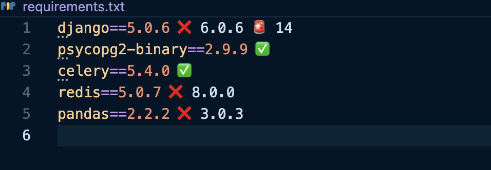

# Review

## Issues or improvments

### Use of hardcoded string instead of enums (Priority: Medium)

This point is important, but can be delay a bit. It will increase quality and avoid later bugs. (Non-typed languages need more precautions).

- `generate_csv.py`, for CATEGORIES, CURRENCIES and STATUSES. The case for MERCHANTS may be different regarding of the number of MERCHANTS. Is it a small list of fixed merchants (the use of an ENUM should be recommended). If it's an non-fixed list of merchants that can change frequently, or that other informations needs to be saved then getting them from a database table is better.
- `models.py`, see the specific point for the details about this.
- `tasks.py`, with the job status.

### Models

#### Implementing choices (Priority: Medium)

Some fields should have a choices attributes that should rely on the enums explained above. It make sures we only store defined values, avoiding typo, etc for `Transaction.currency`, `Transaction.category`, `Transaction.status`, and possibly `Transaction.merchant` (see discussion above).

#### Creating a relationship between Transaction and ImportJob (Priority: Medium)

It could be interesting if we want to remove an import to have all the related transactions deleted, as we could create a DELETE cascade, using a [models.ForeignKey](https://docs.djangoproject.com/en/6.0/ref/models/fields/#foreignkey).

#### Using a UUIDField (Priority: Low)

For `Transaction.reference`.
Also a new file `ImportJob.reference` could be added to track the relationship between Import and Transaction. 

This two UUIDField could be used as primary key unless we choose the strategy to never exposed the underlying primary key.

https://docs.djangoproject.com/en/6.0/ref/models/fields/#uuidfield

#### Using a FileField for the uploaded file (Priority: Low)

https://docs.djangoproject.com/en/6.0/ref/models/fields/#filefield

This would be better than using a string for storing the file name

#### Implementing filename unicity (Priority: Low)

The idea here is to avoid duplicated file upload. The current implementation does not handle this issue for now.

The field has no unicity so a single file can be uploaded multiple times, triggering multiple times `import_transactions` that will parse existing rows to insert nothing (waste of resources).

It's better to have a check on the database to throw early with a HTTP status of 409 Conflict.

Note: a user can rename the file that will trigger the import process which will reject all rows.

### Tasks

#### Memory issue (Priority: High)

The current `import_transactions` load the entire file in memory which can have serious performances issues.

The solution is to read the CSV file in chunks.

#### DB unoptimization calls

There are multiple calls to `job.save()` which is not efficient:

- before the CSV parsing,
- after the CSV parsing,
- each time a row is inserted (very inefficient)
- when the process is completed.

I would recommend 2 options:

- only save the import when the process is complete,
- better, insert the job on entering the function, and when the process is complete.

And by the way instead of calling the DB on each transaction row, it's better to do a bulk insert of the non duplicate rows in the current chunk.

#### Row duplication check (Priority: Medium)

The current implementation is not efficient has it fetches the database on each row to check if the reference has not been already inserted. 

Multiple ways could be used to solve this issue:
- create a dict variable that holds reference string of previously inserted references. It simplifies the operation of looking for an existing row.
- if the uploaded CSV files can have a large number of rows, then migrating to redis instead of a local dict could help. It would also improve the process has we can relaunch a failing tasks has the previously inserted references could be safely ignored. It would need some changes to distinguish previously inserted references in the current CSV file from previously references inserted in a previous CSV file.

### Docker (Priority: High)

Credentials are added to the docker-compose.yml which is committed to the repository. It's highly recommended to use environment variables instead, as it creates a security risk.

### Views

#### Upload dir setup 

```python
UPLOAD_DIR = "/tmp/imports"
os.makedirs(UPLOAD_DIR, exist_ok=True)
```

This code is problematic has it raises an exception if the directory exists.

#### File location (Priority: Medium)

It would be more appropriate to have a S3 space to save the uploaded files. It will enable scaling the application or migrating to a micro service architecture.

Temporary files will be probably lost on server restart.

#### SummaryView

##### Missing sanity checks (Priority: High)

There is no check on the validity of the `from` and `to` query parameters. If using any invalid string it fails.

```bash
curl -I "http://localhost:8010/api/summary/?from=2024-01-01&to=test"
HTTP/1.1 500 Internal Server Error
```

##### Performance issue (Priority: High)

The aggregated results are implemented server-side while it would be more efficient if done by the database layer.

### Tests

There are no unit or functional tests in the project!

The project being quite simple implementing only functional tests for the API services and the `import_transactions` task would provide some confidence on the project stability.

### API (Priority: High)

http://localhost:8010/api/summary/?from=2024-01-01&to=2024-06-30

#### Response
```json
{
   "results" : [
      {
         "category" : "health",
         "total" : 410572.67
      },
      {
         "category" : "utilities",
         "total" : 401786.64
      },
      {
         "category" : "entertainment",
         "total" : 394079.14
      },
      {
         "category" : "transport",
         "total" : 392922.41
      },
      {
         "category" : "food",
         "total" : 382800.75
      },
      {
         "category" : "travel",
         "total" : 376158.68
      }
   ]
}
```

The response is not correct has it does not take into account the currency.

There are different way to fix this. The choice should be made with the Product owner.

- we can expose a global summary with an array of amount by currency (1),
- we can expose a summary per currency (2),
- we can expose a query parameter currency that displays only the aggregate data for this currency (3).

##### Choice 1

```json
{
  "results": [
    {
      "category": "String",
      "total": [
        {
          currency: "Currency",
          total: "Number"
        }
      ]
    }
  ]
}
```

##### Choice 2

```json
{
  "results": [
    {
      "currency": "Currency",
      "summary": [
        {
          "category": "String",
          "total": "Number"
        }
      ]
    }
  ]
}
```

##### Choice 3

```json
{
  "results" : [
    {
      "category": "String",
      "total": "Number"
    }
  ]
}
```

### generate_csv.py (Priority: Low)

This file being just a script for starting up, while it works we tend to do quick and dirty.

I would only fix the enums defined in [Use of hardcoded string instead of enums](## Use of hardcoded string instead of enums).

The STATUSES array is a trick to play with probability that is acceptable in a quick and dirty fix, as improving it takes more time and complexity than the gain it provides.

### Outdated dependencies (Priority: Medium or High)



Django version has 14 vulnerabilities that are available for the current 5.0.6 version.

Update risks should be evaluated to understand if some parts are at risks as it can create possible issues.


## TO BE DONE

